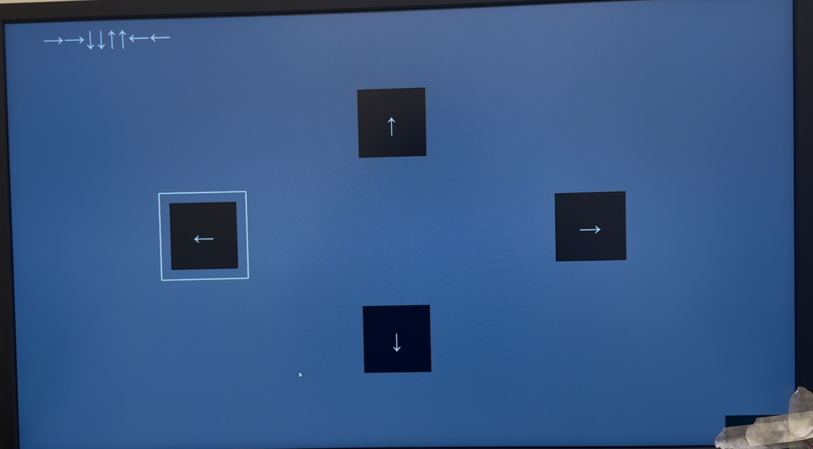

# **COGS 189 - BCI Project (OpenVEP)**

This repository is part of the **COGS 189 Brain-Computer Interface (BCI) group**, consisting of the following members:

**Team Members:**

- **Edwin Ruiz**
- **Vishal Patel**
- **Dante Testini**
- **Nancy Shen**
- **Sarah R. Bulawayo**
- **Andy Huang**

This sub-repo, **OpenVEP**, is the **"online" group** responsible for real-time Steady-State Visually Evoked Potential (SSVEP) classification and cursor control mapping.

This repository is a **cloned version of Simon Fei's OpenVEP repository**, with modifications and extensions specific to our experiment.

- **Original Repository:** [Simon Fei’s OpenVEP](https://github.com/simonfei123/OpenVEP)
- **Contact:** Simon Fei - [tfei@ucsd.edu](mailto\:tfei@ucsd.edu)

- The `run_vep.py` is the original run_vep code from Simon's Repository.

## **Experiment Details**

We have officially completed the **SSVEP portion** of our experiment in this repository. The experiment involved real-time classification of SSVEP signals to predict which visual stimulus a subject was attending to.

### **Experiment Configuration**

- **Subject:** Edwin Ruiz
- **Technician/Experimenter:** Vishal Patel
- **Session Details:**
  - **1 subject, 1 session, 10 runs**
  - **Training script:** `train_trca.py`
  - **Experiment script:** `run_vep_4.py`

**Configuration in ************************************`run_vep_4.py`************************************:**

```python
cyton_in = True
lsl_out = False
stim_duration = 1.2
n_per_class = 2
stim_type = 'alternating' # 'alternating' or 'independent'
subject = 1
session = 1
calibration_mode = False #Calibration Mode=True, Prediction Mode=False
save_dir = f'data/cyton8_{stim_type}-vep_4-class_{stim_duration}s/sub-{subject:02d}/ses-{session:02d}/' # Directory to save data to
run = 1 # Run number, it is used as the random seed for the trial sequence generation
model_file_path = 'cache/FBTRCA_model.pkl'
```

### **Calibration Mode**

The experiment consists of two primary modes: **Calibration Mode** and **Prediction Mode**.

- **Calibration Mode (********`calibration_mode = True`********)**

  - In this mode, the system collects EEG data for each trial and saves it for later analysis.
  - The collected data is used to train a model that can predict the target based on the EEG signals.
  - Visual stimuli are displayed while EEG data is recorded and stored in `.npy` format.
  - The exact line where this is defined in `run_vep_4.py`:
    ```python
    calibration_mode = True
    ```

- **Prediction Mode (********`calibration_mode = False`********)**

  - In this mode, the pre-trained model is applied in real time to predict the target based on EEG signals.
  - The visual stimuli remain, but instead of collecting new training data, the system processes the signals and makes real-time predictions.
  - The output updates the display to reflect the predicted target based on brain activity.
  - The exact line where this is defined in `run_vep_4.py`:
    ```python
    calibration_mode = False
    ```

### **SSVEP Stimulus Frequencies**

The visual stimuli consist of four flickering squares, each emitting a different frequency to induce SSVEP responses in the subject’s occipital lobe. The selected stimulus frequencies are:

- **8 Hz**
- **10 Hz**
- **12 Hz**
- **15 Hz**

These frequencies are used in conjunction with a phase shift of `0` radians to generate alternating visual flickers. The EEG responses to these frequencies are classified using the trained model.

- The exact line where these frequencies are defined in `run_vep_4.py`:
  ```python
  stimulus_classes = [(8, 0), (10, 0), (12, 0), (15, 0)]
  ```

## **Experiment Setup & Execution**

### **Lab Computers Setup**
> This is only for setup on the Lab computer for COGS 189

1. Sign in to lab computer using your UCSD credentials
2. Open VS Code
3. Git clone this repository into THIS directory:
- C://Users/{your_username}/
4. Click "install" on the pop that appears on the bottom right of the vs code application
5. Go to the `run_vep.py` file and hit run (should give you error)
6. Look at the terminal and you should see something in the format of "**& c:/Users/{your_username}/OpenVEP/pyenv/Scripts/python.exe**"
 - This is your python file path and you will use this instead of typing `python`
7. run `& c:/Users/{your_username}/OpenVEP/pyenv/Scripts/python.exe -m pip install virtualenv`
8. run `& c:/Users/{your_username}/OpenVEP/pyenv/Scripts/python.exe -m pip install virtualenv -m virtualenv pyenv --python=3.11.9`
9. run `Set-ExecutionPolicy -ExecutionPolicy RemoteSigned -Scope CurrentUser`
10. run `pyenv/Scripts/activate` (This will activate the virtual environment)
11. run pip install -r requirements.txt
12. run git clone https://github.com/TBC-TJU/brainda.git (incase you don't have the brainda folder already)
13. run cd brainda
14. run pip install -r requirements.txt
15. run pip install -e .

### **EEG Hardware & Electrode Placement**

- **EEG Device:** [OpenBCI Cyton Biosensing Board (8-Channel)](https://shop.openbci.com/collections/frontpage/products/cyton-biosensing-board-8-channel)
- **Electrode Cap:** [OpenBCI EEG Electrode Cap Kit](https://shop.openbci.com/products/openbci-eeg-electrocap)
- **Electrode Gel:** [OpenBCI Electrode Cap Gel](https://shop.openbci.com/products/electrodegel)
- **Electrode Placement (10-20 System):**
  - **Ground:** Fz
  - **Reference:** F4
  - **EEG Channels:**
    - **O1 (Channel 1)**
    - **O2 (Channel 2)**
    - **T5 (Channel 3)**
    - **P3 (Channel 4)**
    - **Pz (Channel 5)**
    - **P4 (Channel 6)**
    - **T6 (Channel 7)**
    - **Cz (Channel 8)**

### **OpenBCI GUI Setup**

1. Open **System Control Panel**
2. Select **Data Source** → "Cyton (live)"
3. Choose **Pick Transfer Protocol** → "Serial (from Dongle)"
4. Select **Serial Connect** → "Manual"
5. Select **Serial/COM Port** → "(Cyton) COMS"
6. Click **Start Session**


## **Experiment Execution**

The experiment involved visually attending to one of four flickering squares, each emitting a different frequency. The recorded EEG signals were then classified to predict which square the subject was focusing on.

- **Stimulus Arrangement:**
  - **4 squares positioned at:**
    - **North, South, West, and East**
- **Each run:**
  - 8 randomized trials per run (2 trials per each square)
  - 10 runs in total
- **Trained Model:** `FBTRCA_model.pkl`
- **Training (Classification) Script:** `train_trca.py`
- **Final Application Demo:** `training_model_test_success*.MOV`


## Data File Explanation
- The `subject` number variable is to represent the "subject" or person who is wearing the EEG Headset
- The `session` variable represents the day of lab testing. So the first day you come in will be `session` 1, the second day you come in will be `session` 2
- The `run` variable represents the "run" of the python code. Every time you run the `run_vep.py` you will increment this value
- The `num_per_class` variable represents how many times of each direction you will see in 1 run

- When running `run_vep.py` you will save two types of files: **aux...** and **eeg_trials...**
- Both of these files are saved as `.npy` files
- These files are then used in the `train_trca.py` to get a trained model in the `.pkl.` format


### Results

- **Training model**: 100% accuracy
  - The model successfully classified SSVEP signals in real time.
- **Testing Real-time BCI:** 100% accuracy
  - In the video, the trained model successfully detected the subject’s focus, highlighting the correct square.

https://github.com/user-attachments/assets/c75bfadf-30ea-4fe6-b056-0ba2697271fc

[SSVEP Training Model Test Success](https://www.youtube.com/watch?v=0Seno1-ghCM)
### **Real-Time Model Application & Next Steps**

The next step is **cursor movement mapping**.

**Objective:** Map the cursor to follow the subject’s gaze. When the BCI highlights a square, the cursor should move toward it.

- **Current Implementation:**
  - The BCI highlights the correct square in real time
  - This is visible in `applied_model_image.jpeg`



- **Next Step:** Implement cursor movement
  - Cursor starts in the center
  - Moves in the direction of the highlighted square
  - Code for this is in `simulating_mapping.ipynb`

### **Task Assignments**

- **Online Group:** Real-time BCI implementation
  - **Edwin Ruiz, Vishal Patel**
- **Offline Group:** Cursor movement mapping
  - **Dante Testini, Nancy Shen, Andy Huang**

## **Repository Structure & Setup**

### **Setup for Windows 11**

```bash
pip install virtualenv
virtualenv pyenv --python=3.11.9
Set-ExecutionPolicy -ExecutionPolicy RemoteSigned -Scope CurrentUser
pyenv\Scripts\activate
pip install -r requirements.txt
git clone https://github.com/TBC-TJU/brainda.git
cd brainda
pip install -r requirements.txt
pip install -e .
```

All Python packages are installed in `pyenv/`, allowing easy removal. To activate the environment, use:

```bash
pyenv\Scripts\activate
```

To deactivate, use:

```bash
deactivate
```

### **Running the VEP Speller**

```bash
python run_vep.py
python scripts/train_trca.py
```

Modify `run_vep.py` to change the run number before each test.

**Expected Accuracy:**

- After 2 runs: \~60%
- After 4 runs: \~70%

